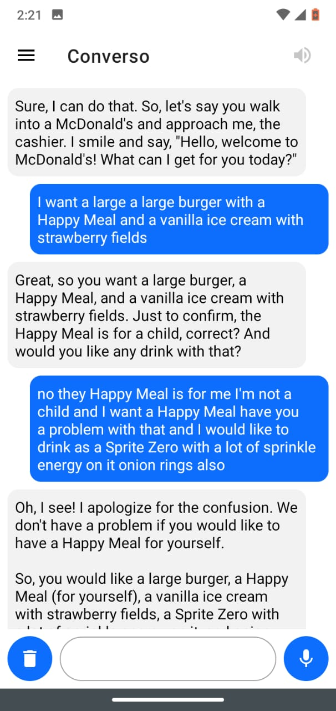
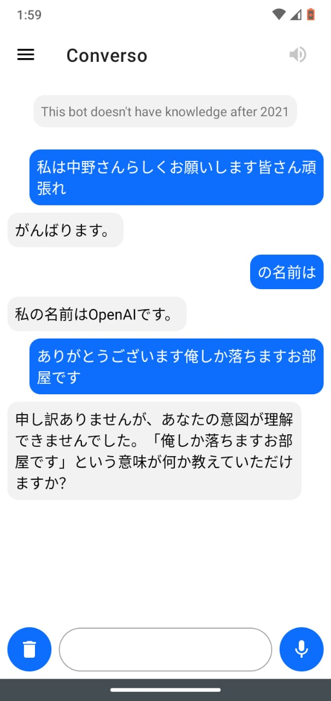
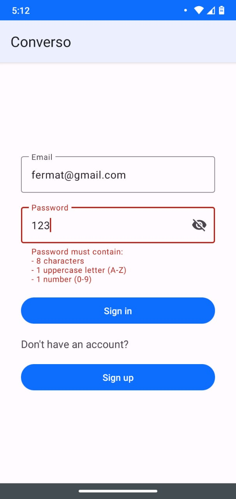

# Converso: GPT-4 Chatbot Android App (OpenAI API)
### Chat in real-time using your voice with an AI chatbot.

 

## Table of Contents
- [Speech to Text](#speech-to-text)
- [Text to Speech](#text-to-speech)
- [OpenAI API](#openai-api)
- [Authentication](#authentication)
- [Classes (and Layouts)](#classes)
- [Libraries](#libraries)

## Speech to Text
It works using the [Android Speech Recognition](https://developer.android.com/reference/kotlin/android/speech/SpeechRecognizer) service to convert the user's speech to text and send it to the [OpenAI API](#openai-api) endpoint.

1. Check the `RECORD_AUDIO` permission at runtime
    - If not granted, request permission
    - If granted, continue
2. Create a `SpeechRecognizer` instance
3. Set a `RecognitionListener` to receive speech recognition events
4. Call `startListening()` to begin recognition when `micButton` is pressed
5. Receive results in `RecognitionListener.onResults()`
6. Send the transcript to the [OpenAI API](#openai-api) (if not empty) as part of the whole chat conversation

For example `micButton` size depends on the [RMS](https://majormixing.com/what-is-rms-in-audio-world/) value of the user's voice.
```kotlin
override fun onRmsChanged(p0: Float) {
    // resize micButton given rms value
    val scale = p0 / 2
    if (scale < 1 || scale > 4) return
    binding.micButton.scaleX = scale
    binding.micButton.scaleY = scale
}
```
RMS stands for Root Mean Square and is a measure of the average power or intensity of a signal.
$$RMS = \sqrt{\frac{1}{N}\sum_{i=1}^{N}x_i^2}$$

## Text to Speech
Converso also uses [Android Text to Speech](https://developer.android.com/reference/android/speech/tts/TextToSpeech) to read the assistant messages out loud.

1. Create a `TextToSpeech` instance
2. Call `setLanguage()` to download voice data (if not installed) e.g. `Locale.US`.
3. Queue responses by calling `speak()`
4. Shutdown properly in `onDestroy()`

It should only speak messages from the assistant, so we can check the `role` property of the message.
```kotlin
// speak message if it's from the assistant
if (message.role == "assistant") {
    textToSpeech.speak(message.content, TextToSpeech.QUEUE_FLUSH, null, null)
}
```

Where `Message` is a [data class](#why-data-class-instead-of-just-class) that represents a chat message in the format received from the [OpenAI API](#openai-api)
```kotlin
data class Message(val role: String, val content: String)
```
And `role` can be `user`, `assistant` or `system` (this last one for context e.g. Keep responses short).

#### Why Data Class instead of just Class?
A data class is a class specifically designed for storing data, and it automatically generates common methods like equals, hashCode, and toString.

## OpenAI API
The crown jewel of this project is the super easy-to-use [OpenAI API](https://openai.com/blog/openai-api) which takes the whole chat conversation (with the user message at the end) and retrieves the generated response from the GPT models. Commonly using `GPT-3.5-turbo` or `GPT-4`.

Given an API Key, that could be edited in the app:

1. Create an `OkHttpClient` instance
2. Build the request with the API Key in the `Authorization` header
3. Send the request to the [OpenAI API](https://openai.com/blog/openai-api) endpoint
4. Deserialize the JSON response with [Gson](https://github.com/google/gson) using the [ResponseJson](app/src/main/java/com/ceibotech/converso/ResponseJson.kt) class and get the response message
5. Add the assistant message to the chat RecyclerView

The `messages` ArrayList is the chat history, which is sent to the OpenAI API as part of the request body.
```kotlin
private fun sendChatToOpenAIAndRetrieveResponse() {

    val headers = Headers.Builder()
        .add("Authorization", "Bearer ${binding.OpenAIAPIKeyEditText.text}")
        .add("Content-Type", "application/json")
        .build()

    val requestData = mapOf(
        "model" to "gpt-3.5-turbo",
        "messages" to messages // where messages is an ArrayList<Message>
    )

    val jsonMediaType = "application/json; charset=utf-8".toMediaType()
    val requestBody = Gson().toJson(requestData).toRequestBody(jsonMediaType)

    val request = Request.Builder()
        .url("https://api.openai.com/v1/chat/completions")
        .headers(headers)
        .post(requestBody)
        .build()

    okHttpClient.newCall(request).enqueue(object : Callback {
        override fun onFailure(call: Call, e: IOException) {
            // if the request fails, show the error message to the user
            runOnUiThread {
                Toast.makeText(this@MainActivity, e.message, Toast.LENGTH_LONG).show()
            }
        }

        override fun onResponse(call: Call, response: Response) {
            if (response.isSuccessful) {
                val responseBody = response.body?.string()
                val responseJson = Gson().fromJson(responseBody, ResponseJson::class.java)
                val responseMessage = responseJson.choices?.get(0)?.message?.content

                if (responseMessage != null) {
                    runOnUiThread {
                        addMessageToChatRecyclerView(Message("assistant", responseMessage))
                    }
                }

            } else {
                // if the response fails, show the error message to the user
                runOnUiThread {
                    Toast.makeText(this@MainActivity, response.message, Toast.LENGTH_LONG).show()
                }
            }
        }
    })
}
```

## Authentication
It works thank to the [Firebase Auth](https://firebase.google.com/docs/auth) service, which provides an easy way to authenticate users with an email address and password.

1. Initialize `FirebaseAuth` instance
2. Check if user is signed in
3. Trigger Email Sign-In flow if not
4. Save user's ID token on successful sign-in
5. Redirect to [MainActivity](app/src/main/java/com/ceibotech/converso/MainActivity.kt)

On [AuthActivity](app/src/main/java/com/ceibotech/converso/AuthActivity.kt) if the user clicks the `signInButton` and the credentials are valid, we call `signIn()`
```kotlin
binding.signInButton.setOnClickListener {
    val email = binding.emailEditText.text.toString()
    val password = binding.passwordEditText.text.toString()

    if (isEmailValid(email) && isPasswordValid(password)) {
        // hide signInButton to prevent multiple signIn at the same time
        binding.signInButton.isEnabled = false
        signIn(email, password)
    }
}
```



Where `isPasswordValid()` checks for a 8 characters, 1 uppercase letter and 1 number password, using [Regex](https://stackoverflow.com/questions/23214434/regular-expression-in-android-for-password-field)
```kotlin
val passwordRegex = Regex("^(?=.*[A-Z])(?=.*[0-9]).{8,}$")
```
#### How does Regex works?
```regex
^                 # start-of-string
(?=.*[0-9])       # a digit must occur at least once
(?=.*[a-z])       # a lower case letter must occur at least once
(?=.*[A-Z])       # an upper case letter must occur at least once
(?=.*[@#$%^&+=])  # a special character must occur at least once you can replace with your special characters
(?=\\S+$)         # no whitespace allowed in the entire string
.{4,}             # anything, at least six places though
$                 # end-of-string
```

In [MainActivity](app/src/main/java/com/ceibotech/converso/MainActivity.kt) we check if the user is signed in and if not we redirect to [AuthActivity](app/src/main/java/com/ceibotech/converso/AuthActivity.kt)
```kotlin
if (savedInstanceState == null) {
    auth = Firebase.auth
    // go to sign in if user is not logged in
    if (auth.currentUser == null) {
        val intent = Intent(this, AuthActivity::class.java)
        startActivity(intent)
        finish()
    }
}
```
`savedInstanceState` helps to avoid checking if user is signed in every time the activity is recreated, for example when the device is rotated.

## Classes
- [AuthActivity](app/src/main/java/com/ceibotech/converso/AuthActivity.kt): Handles user authentication.
    - [activity_auth.xml](app/src/main/res/layout/activity_auth.xml)
- [MainActivity](app/src/main/java/com/ceibotech/converso/MainActivity.kt): Chat with the assistant/edit API Key.
    - [activity_main.xml](app/src/main/res/layout/activity_main.xml)
- [Message](app/src/main/java/com/ceibotech/converso/Message.kt): Data class that represents a chat message in the format received from the OpenAI API.
- [ChatAdapter](app/src/main/java/com/ceibotech/converso/ChatAdapter.kt): Adapter for the chat RecyclerView.
- [MessageViewHolder](app/src/main/java/com/ceibotech/converso/MessageViewHolder.kt): ViewHolder for the chat RecyclerView.
    - Inflates [user_message.xml](app/src/main/res/layout/user_message.xml) or [assistant_message.xml](app/src/main/res/layout/assistant_message.xml) depending on the message `role`.
- [ResponseJson](app/src/main/java/com/ceibotech/converso/ResponseJson.kt): Represents the JSON response from the OpenAI API.

## Libraries
- [OkHttp](https://square.github.io/okhttp/) - Handling networking requests
- [Gson](https://github.com/google/gson) - Handling networking requests
- [Material Design](https://m3.material.io/) - UI components
- Firebase
    - [Auth](https://firebase.google.com/docs/auth) - Email Sign-In