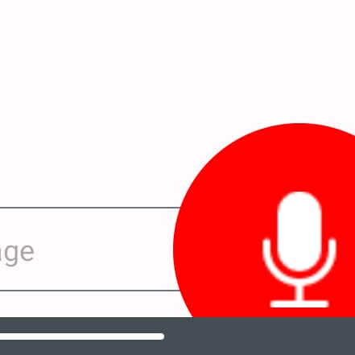
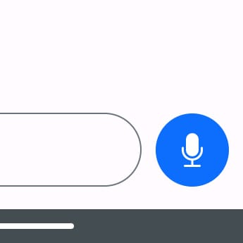

# Converso: GPT-4 Chatbot Android App (OpenAI API)
### Chat in real-time using your voice with an AI chatbot.

 

## Table of Contents
- [Speech to Text](#speech-to-text)
- [Text to Speech](#text-to-speech)
- [OpenAI API](#openai-api)
- [Authentication](#authentication)
- [Realtime Database](#realtime-database)
- [Classes (and Layouts)](#classes)
- [Libraries](#libraries)

## Speech to Text
It works using the [Android Speech Recognition](https://developer.android.com/reference/kotlin/android/speech/SpeechRecognizer) service to transform user's voice into text. The text is then sent to the [OpenAI API](#openai-api) endpoint to retrieve the generated response.

1. Check the `RECORD_AUDIO` permission at runtime
    - If not granted, request permission
    - If granted, continue
2. Create a `SpeechRecognizer` instance
3. Set a `RecognitionListener` to receive speech recognition events
4. Call `startListening()` to begin recognition when `micButton` is pressed
5. Receive results in `RecognitionListener.onResults()`
6. Send the transcript (if not empty) to the [OpenAI API](#openai-api) endpoint within the whole chat conversation

#### Screenshots
 

`micButton` size relies on the [RMS](https://majormixing.com/what-is-rms-in-audio-world/) value of the user's voice, which is received in `RecognitionListener.onRmsChanged()`.
```kotlin
override fun onRmsChanged(p0: Float) {
    // Resize micButton given RMS value
    val scale = p0 / 2
    if (scale < 1 || scale > 4) return
    binding.micButton.scaleX = scale
    binding.micButton.scaleY = scale
}
```
RMS stands for Root Mean Square and is a measure of the average power or intensity of a signal.
$$RMS = \sqrt{\frac{1}{N}\sum_{i=1}^{N}x_i^2}$$

## Text to Speech
Converso also uses [Android Text to Speech](https://developer.android.com/reference/android/speech/tts/TextToSpeech) to read assistant's messages out loud. 

1. Create a `TextToSpeech` instance
2. Call `setLanguage()` to download voice data (if not installed) e.g. `Locale.US`.
3. Queue responses by calling `speak()`
4. Shutdown properly in `onDestroy()`

It should only speak messages from the assistant, so we can check the message's `role`.
```kotlin
// Speak message if it comes from the assistant
if (message.role == "assistant") {
    textToSpeech.speak(message.content, TextToSpeech.QUEUE_FLUSH, null, null)
}
```

Where `Message` is a [data class](#class-vs-data-class) that represents a chat message in the same format received from the [OpenAI API](#openai-api).
```kotlin
data class Message(val role: String, val content: String)
```
Where `role` can take 3 different values: `user`, `assistant` or `system` (system is used for context e.g. "Keep responses short") and `content` is just the text.

#### Class vs. Data Class
A data class is a class specifically designed for storing data, so it automatically generates common methods like `equals`, `hashCode`, and `toString`.

## OpenAI API
The crown jewel of this project is the super easy-to-use [OpenAI API](https://openai.com/blog/openai-api) which takes the whole chat conversation (with the new user message at the end) and retrieves the generated response from the [GPT](https://en.wikipedia.org/wiki/Generative_pre-trained_transformer) models. Commonly using `GPT-3.5-turbo` or `GPT-4`.

Given an API Key, that could be edited at the app:

1. Create an `OkHttpClient` instance
2. Build a request with the API Key in the `Authorization` header
3. Send the request to the [OpenAI API](https://openai.com/blog/openai-api) endpoint
4. Deserialize the JSON response with [Gson](https://github.com/google/gson) using [ResponseJson.kt](app/src/main/java/com/ceibotech/converso/ResponseJson.kt)
5. Add the new assistant message to the chat RecyclerView using the [MessageAdapter](app/src/main/java/com/ceibotech/converso/MessageAdapter.kt)

`messages` is an `ArrayList<Message>` that contains the whole chat, and is sent to the endpoint as part of the request body.
```kotlin
private fun sendChatToOpenAIAndRetrieveResponse() {

    val headers = Headers.Builder()
        .add("Authorization", "Bearer ${binding.OpenAIAPIKeyEditText.text}")
        .add("Content-Type", "application/json")
        .build()

    val requestData = mapOf(
        "model" to "gpt-3.5-turbo",
        "messages" to messages
    )

    val jsonMediaType = "application/json; charset=utf-8".toMediaType()
    val requestBody = Gson().toJson(requestData).toRequestBody(jsonMediaType)

    val request = Request.Builder()
        .url("https://api.openai.com/v1/chat/completions")
        .headers(headers)
        .post(requestBody)
        .build()

    okHttpClient.newCall(request).enqueue(object : Callback {
        override fun onFailure(call: Call, e: IOException) {
            // if the request fails, show the error message to the user
            runOnUiThread {
                Toast.makeText(this@MainActivity, e.message, Toast.LENGTH_LONG).show()
            }
        }

        override fun onResponse(call: Call, response: Response) {
            if (response.isSuccessful) {
                val responseBody = response.body?.string()
                val responseJson = Gson().fromJson(responseBody, ResponseJson::class.java)
                val responseMessage = responseJson.choices?.get(0)?.message?.content

                if (responseMessage != null) {
                    runOnUiThread {
                        addMessageToChatRecyclerView(Message("assistant", responseMessage))
                    }
                }

            } else {
                // if the response fails, show the error message to the user
                runOnUiThread {
                    Toast.makeText(this@MainActivity, response.message, Toast.LENGTH_LONG).show()
                }
            }
        }
    })
}
```

## Authentication
It works thanks to the [Firebase Auth](https://firebase.google.com/docs/auth) service, which provides an easy way to authenticate users with an email and password.

1. Initialize `FirebaseAuth` instance
2. Check if user is logged in
3. Go to [AuthActivity](app/src/main/java/com/ceibotech/converso/AuthActivity.kt) if not
4. Let the user create an account or sign in
5. Redirect to [MainActivity](app/src/main/java/com/ceibotech/converso/MainActivity.kt)

On [AuthActivity](app/src/main/java/com/ceibotech/converso/AuthActivity.kt) if the user clicks the `signInButton` and the credentials are valid, we call `signIn()`
```kotlin
private fun performAuth(signIn: Boolean) {
    val email = binding.emailEditText.text.toString()
    val password = binding.passwordEditText.text.toString()

    if (isEmailValid(email) && isPasswordValid(password)) {
        toggleButtons(false) // disable buttons to avoid multiple requests

        if (signIn) signIn(email, password)
        else signUp(email, password)
    }
}
```

#### Screenshot


Where `isPasswordValid()` uses this [regex](https://en.wikipedia.org/wiki/Regular_expression):
```kotlin
Regex("^(?=.*[A-Z])(?=.*[0-9]).{8,}$")
```

#### Regex pattern examples
```regex
^                 # start-of-string
(?=.*[0-9])       # a digit must occur at least once
(?=.*[a-z])       # a lower case letter must occur at least once
(?=.*[A-Z])       # an upper case letter must occur at least once
(?=.*[@#$%^&+=])  # a special character must occur at least once you can replace with your special characters
(?=\\S+$)         # no whitespace allowed in the entire string
.{4,}             # anything, at least six places though
$                 # end-of-string
```

Each time the user opens the app, it goes to [MainActivity](app/src/main/java/com/ceibotech/converso/MainActivity.kt) and checks if they are logged in. If not, they are redirected to [AuthActivity](app/src/main/java/com/ceibotech/converso/AuthActivity.kt) as follows:
```kotlin
if (savedInstanceState == null) {
    auth = Firebase.auth
    database = Firebase.database

    // go to AuthActivity if user is not logged in
    if (auth.currentUser == null) {
        startActivity(Intent(this, AuthActivity::class.java))
        finish()
    }
}
```
Where `savedInstanceState` helps to preserve the session when the activity is recreated e.g. rotated device.

## Realtime Database
Using the [Firebase Realtime Database](https://firebase.google.com/docs/database) we can store the token usage of each user, and limit the number of requests per day.

Incrementing `tokenUsage` for each assistant response
```kotlin
tokenUsage += responseJson.usage.total_tokens
```

And then updating the database
```kotlin
val userRef = database.getReference("users/${auth.currentUser?.uid}/token_usage")
userRef.get()
    .addOnSuccessListener {
        userRef.setValue(tokenUsage)
    }
    .addOnFailureListener {
        Log.e("Error updating tokenUsage", it.message!!)
    }
```

## Classes
- [AuthActivity](app/src/main/java/com/ceibotech/converso/AuthActivity.kt): Login/Sign up screen.
    - [activity_auth.xml](app/src/main/res/layout/activity_auth.xml)
- [MainActivity](app/src/main/java/com/ceibotech/converso/MainActivity.kt): Main screen where you can chat with the assistant or edit your OpenAI API Key and System Prompt.
    - [activity_main.xml](app/src/main/res/layout/activity_main.xml)
- [Message](app/src/main/java/com/ceibotech/converso/Message.kt): Data class formatted as the OpenAI API expects.
- [MessageAdapter](app/src/main/java/com/ceibotech/converso/MessageAdapter.kt): Chat's RecyclerView Adapter.
- [MessageViewHolder](app/src/main/java/com/ceibotech/converso/MessageViewHolder.kt): Chat's RecyclerView ViewHolder.
    - Inflates [user_message.xml](app/src/main/res/layout/user_message.xml) or [assistant_message.xml](app/src/main/res/layout/assistant_message.xml) depending on the message's `role`.
- [ResponseJson](app/src/main/java/com/ceibotech/converso/ResponseJson.kt): Classes to represent the JSON response from OpenAI.
- [User](app/src/main/java/com/ceibotech/converso/User.kt): Data class to represent a user in the database.

## Libraries
- [OkHttp](https://square.github.io/okhttp/): HTTP client
- [Gson](https://github.com/google/gson): JSON serialization/deserialization
- [Material Design](https://m3.material.io/): UI components
- Firebase
    - [Auth](https://firebase.google.com/docs/auth): Authentication
    - [Realtime Database](https://firebase.google.com/docs/database): Database